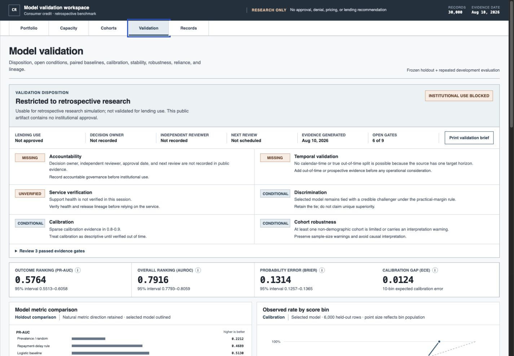
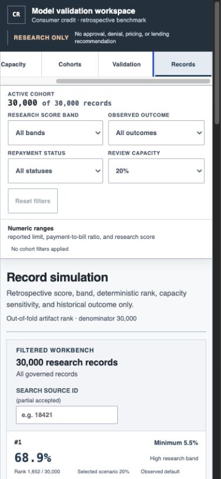

# Credit Risk Model Validation & Review-Capacity Lab

This project asks a narrower and more useful question than “how accurate is the model?”: does a non-demographic research model produce stable evidence beyond simple references, and what does a fixed review workload capture on a held-out historical sample?

The answer is deliberately bounded. On the frozen 6,000-row holdout, the selected model records PR-AUC `0.5764`, AUROC `0.7916`, Brier score `0.1314`, and 10-bin ECE `0.0124`. Repeated paired development tests support it over prevalence/random, a fixed repayment-delay rule, and logistic regression. Its advantage over calibrated Extra Trees does not clear the prespecified practical margin, so that comparison is reported as a tie.

The verified read-only lab is live at [consumer-credit-risk-workbench.pages.dev](https://consumer-credit-risk-workbench.pages.dev). It is a retrospective academic benchmark, not a lending system.





## What it does

### The analytical problem

A single holdout score does not answer the questions a model reviewer actually has:

- Is the result stable across development splits?
- Is it meaningfully better than simple, documented references?
- How much uncertainty surrounds a fixed review workload?
- Is calibration acceptable, and where are the bins too sparse to trust?
- Does performance weaken in large non-demographic cohorts?
- Which feature groups does the fitted model rely on?
- Can an individual record be inspected without turning research evidence into a credit decision?

The lab makes those questions visible in one workflow and keeps four evidence populations separate: the frozen holdout, repeated development folds, the full licensed artifact, and live service health.

## Data and decision boundary

The source is the [UCI Default of Credit Card Clients dataset](https://archive.ics.uci.edu/dataset/350/default+of+credit+card+clients), licensed CC BY 4.0: 30,000 rows, 25 columns, no missing cells, and no duplicate source IDs in the acquired workbook.

Sex, education, marriage, and age are excluded from model inputs and public individual records. They remain local and appear only in the documented aggregate fairness audit. The public artifact contains licensed non-demographic research fields, deterministic derived measures, and retrospective out-of-fold scores.

At record level the interface shows only the academic source ID, retrospective out-of-fold score, score band, deterministic rank and denominator, selected capacity, historical outcome, and the minimum simulated capacity required to include that rank. It states:

> This rank sensitivity is not an approval, denial, price, adverse-action reason, or lending recommendation.

## Problem-solving approach

1. **Lock selection before the final audit.** Model and hyperparameter selection use the original 18,000-row train and 6,000-row validation sets. The 6,000-row holdout is frozen by its ID checksum and excluded from further selection.
2. **Test stability on development data.** Two repeats of three shared stratified folds compare all candidates on identical rows.
3. **Use a reference ladder.** Prevalence/random, logistic regression, and a fixed repayment-delay rule set a progressively stronger bar.
4. **Predefine what counts as resolved.** Paired 95% intervals must clear practical margins; otherwise the result is a tie.
5. **Put workload beside discrimination.** Five review-capacity points report queue composition, capture, precision, recall, lift, incremental yield, and 95% intervals.
6. **Look for weak spots.** Calibration slope/intercept, sparse bins, sample-size-aware cohort checks, and feature-group ablations qualify the headline metrics.
7. **Bind claims to lineage.** Evaluation schema, UTC generation time, source checksum, evaluated revision, split identities, command, tool versions, and artifact hashes travel with the release.

## Evaluation

| Question | Result | Qualification |
| --- | --- | --- |
| Frozen-holdout ranking | PR-AUC `0.5764`; AUROC `0.7916` | Fixed stratified sample, not out-of-time validation |
| Probability quality | Brier `0.1314`; ECE `0.0124` | Calibration slope `1.0743`, intercept `0.0757`; the `0.8–0.9` bin has only 18 rows |
| Stability | Mean development PR-AUC `0.5513` across six paired folds | Repeated folds are correlated views of one historical population |
| Strongest model comparison | Extra Trees mean PR-AUC `0.5452`; selected-model delta `0.0061` (`0.0019–0.0109`) | Tie: the interval does not clear the `0.010` practical margin |
| 10% review capacity | 600 rows; 431 historical defaults; precision `0.7183`; recall `0.3248`; lift `3.2479` | Historical audit-sample estimate, not staffing or benefit forecast |
| Largest ablation loss | Repayment-status group: PR-AUC loss `0.0982` (`0.0845–0.1141`) | Model-reliance evidence only, never a cause or consumer explanation |

The readiness verdict is: **usable for retrospective research simulation; not validated for lending use**.

## Design approach

The interface is shaped as an internal validation workstation, not a marketing dashboard. Validation opens with a research-only disposition, visible missing evidence, and a gate register before performance detail. Compact navigation keeps portfolio posture, review capacity, cohort checks, data quality, and rank sensitivity close together. Definitions and limitations appear progressively, while chart data remains available in semantic tables.

The mobile record view is its own review composition rather than a clipped desktop table. Keyboard controls, visible focus, loading, empty, error, unavailable, and refusal states are part of the product contract. Native SVG and semantic HTML avoid a chart-library dependency.

## Architecture

```text
checksum-pinned UCI workbook
  → schema and range validation
  → locked selection + frozen holdout + repeated development evaluation
  → versioned evaluation and release artifacts
  → 30,000-row non-demographic analyst artifact
  → React validation workstation on Cloudflare Pages
  → read-only release and health functions backed by Neon
```

The production path uses Cloudflare Pages/Workers Free and Neon Free. It accepts no viewer writes and adds no visitor analytics or scheduled monitoring. The health API identifies the published M10 model release; `/source.json` identifies only the exact sanitized application-source commit and exposes no historical revision identifiers.

See [docs/architecture.md](docs/architecture.md) for the current and scaled topologies.

## Scaling

The current 30,000-row artifact keeps filtering and record inspection client-side, avoiding a public per-record API and viewer credentials. At materially larger row counts, move filtered aggregates and paginated records behind a read-only API while preserving the same schema validation, privacy boundary, release lineage, and fail-closed behavior. A recurring validation program would also require new time-indexed data, drift ownership, alert thresholds, and evidence retention before any operational automation.

## Reproduce and verify

Prerequisites are Python 3.11+, `uv`, Node.js, and pnpm. The checksum-pinned source workbook stays under ignored `data/raw/`. Its manifest stays in the private sibling operations directory; set `CREDIT_RISK_DATA_MANIFEST` to use another local path. In development, Vite uses a generated local analyst artifact when present and otherwise redirects only that request to the verified canonical deployment. Production never falls back to another deployment.

```bash
uv sync
uv run python scripts/run_evaluation.py
uv run python scripts/build_release.py --revision <immutable-git-sha>
uv run python scripts/build_public_dataset.py
uv run pytest -q

cd web
pnpm lint
pnpm test
pnpm build
```

Before any separately approved release, run the full gate in [docs/RELEASE-CHECKLIST.md](docs/RELEASE-CHECKLIST.md). Metric definitions are in [docs/metric-glossary.md](docs/metric-glossary.md), scope is in [docs/scope.md](docs/scope.md), and the complete evidence-backed narrative is in [CASE-STUDY.md](CASE-STUDY.md).

## Limits

This is one historical academic population with one target horizon. It has no calendar-time, external, geographic, prospective, drift, operational, causal, loss, pricing, or lending-decision validation. The public app is a research and portfolio demonstration; it is not a production credit service.

## License

Project code and documentation are available under the [MIT License](LICENSE). The UCI Default of Credit Card Clients dataset remains licensed separately under CC BY 4.0 with attribution.
